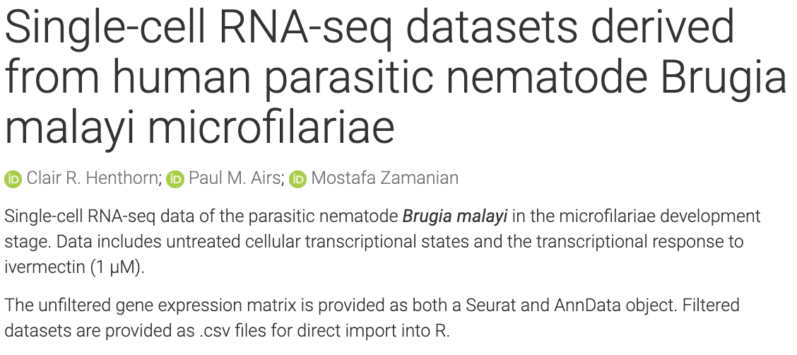
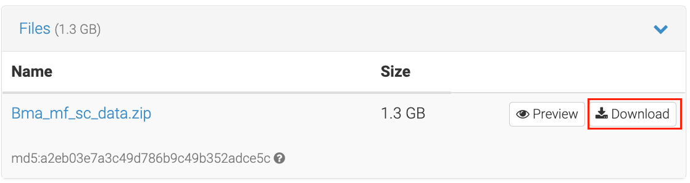
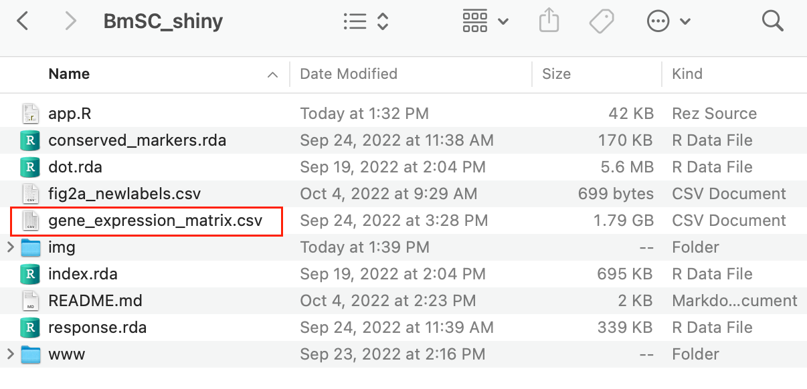
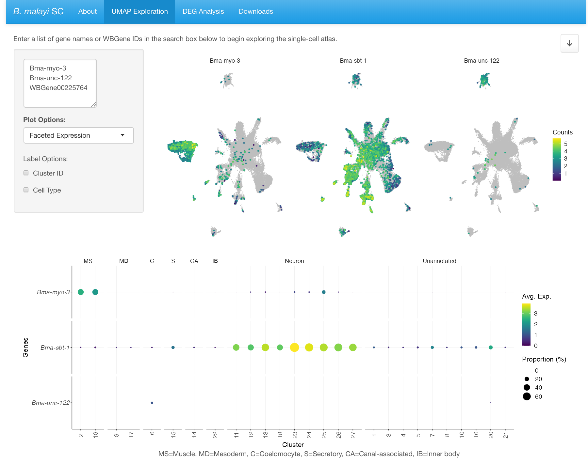
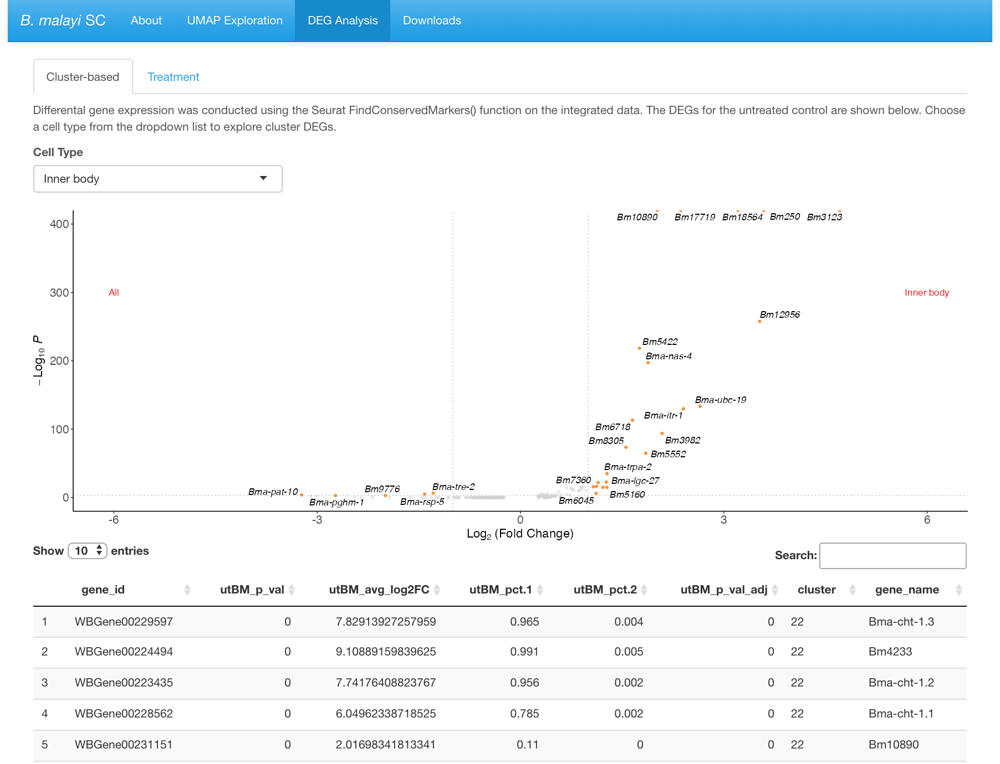

# Overview

This repository contains the R code and data to produce the interactive shiny application for exploring the _B. malayi_ microfilariae single-cell transcriptomic atlas. For more background information on how the data was generated, please consult the associated [preprint](https://www.biorxiv.org/content/10.1101/2022.08.30.505865v1). 

Please submit application and/or code issues to the repository Issues board. 

# Running App Locally
This app can be run locally by cloning this repo to your machine and following the directions below:

1. Download the gene expression matrix (gene_expression_matrix.csv) from [Zenodo](https://zenodo.org/record/7110316#.YzhFFOzMI6E). 
    
    
    Then place the matrix .csv file in the BmSC_shiny directory.
    

2. Open the app.R file in RStudio. Follow the directions in the script to install the required packages and load in the data.

3. After loading in the data, assign the <code>ui</code> and <code>server</code> objects and run the app by running the <code>shinyApp(ui = ui, server = server)</code> function.

## UMAP Exploration
This tab provides the user the opportunity to explore gene expression by UMAP and dotplot visualization. Users can search the data by submitting multiple gene inputs using the _B. malayi_ gene name or WBGene ID. 

## DEG Analysis
This tab contains data pertaining to differential expression analysis by cell type or by treatment. Visualization by volcano plot or exploration of the table provides the user with cluster or treatment-specific gene expression. 

## Downloads
All datasets used in the shiny app are available for download under this tab. In addition, the Seurat or AnnData objects of the entire _B. malayi_ microfilariae single-cell transcriptome, including the data for the cell population treated with ivermectin (1 μM), can be downloaded for personal analysis from [Zenodo](https://zenodo.org/record/7110316#.YzhFFOzMI6E).

